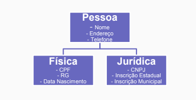

# Atividade

## [Universidade Tiradentes 2022]

Crie um projeto que possua a hierarquia abaixo:

Construa um programa principal para popular essas informações
adequadamente (uma pessoa física e outra jurídica).
