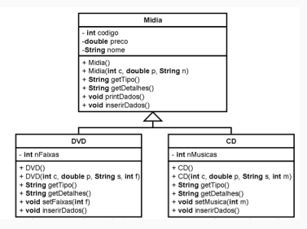
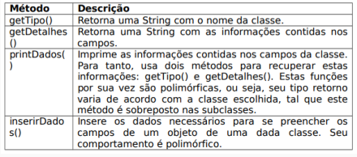

# Atividade

## [Universidade Tiradentes 2022]

Uma loja que vende CD e DVDS deseja construir um cadastro com dos
seus produtos.

Descrição dos métodos:

Crie um programa que simule o uso de um cadastro de CD e DVDs.
